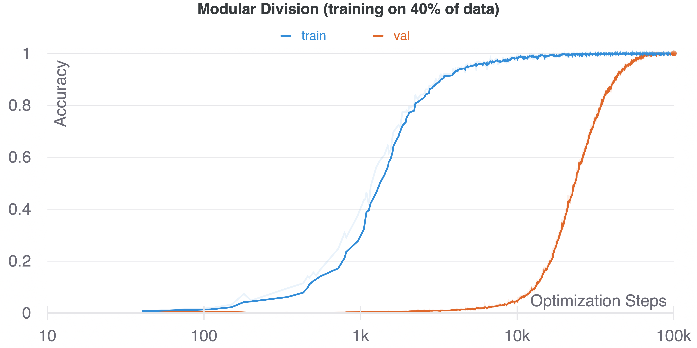

# Grokking Predicted via Local Intrinsic Dimensions of Contextual Language Models

*Grokking* is the phenomenon where a machine learning model trained on a small dataset learns to generalize well beyond the training set after a long period of overfitting.
We demonstrate that the grokking phenomenon can be predicted by the local intrinsic dimension of the model's hidden states.

This repository is based on an unofficial re-implementation of the paper [Grokking: Generalization Beyond Overfitting on Small Algorithmic Datasets](https://arxiv.org/abs/2201.02177) by Power et al.
The original codebase that we base our work on was written by Charlie Snell.
The code been extended to allow the computation of topological local estimates of the language model's hidden states during the training process.

This package uses [Hydra](https://hydra.cc/docs/intro) to handle the configuration.
See the `Hydra` documentation or our description below to learn how to change configurations in the `config/` directory or via command line arguments.

## General setup

1. Clone the repository, and move into the directory:

```bash
git clone [REPOSITORY_URL] grokking
cd grokking/
```

1. This package works with the [uv](https://docs.astral.sh/uv/) Python package and project manager.
If you already have `uv` installed, you can create a new environment as follows:

```bash
uv lock
uv sync
```

1. Now, you can directly run the training script as indicated below via `uv run`.
If you would like to use the package in another way, you can start a python interpreter in the environment:

```bash
uv run python3
```

In the interpreter, you can import the package as follows:

```bash
Python 3.12.9 (main, Mar 17 2025, 21:36:21) [Clang 20.1.0] on darwin
Type "help", "copyright", "credits" or "license" for more information.
>>> import grokking
```

## Project-specific setup

1. Set the correct environment variables used in the project config.
Edit the script `grokking/setup/setup_environment.sh` with the correct paths and run it once.

```bash
./grokking/setup/setup_environment.sh
```

1. If required, e.g. when planning to run jobs on a cluster via a custom hydra launcher, set the correct environment variables in the `.env` file in the project root directory.

1. For setting up the repository to support job submissions to a cluster using a Hydra multi-run launcher, follow the instructions here: [https://github.com/carelvniekerk/Hydra-HPC-Launcher].

## Usage

We define `uv run` commands in the `pyproject.toml` file, which can be used as entry points to run the code.

The training script uses [Weights And Biases](https://wandb.ai/home) by default to generate plots in realtime.
If you would not like to use wandb, just set `wandb.use_wandb=False` in `config/train_grokk.yaml` or as an argument when calling `train_grokk.py`.
In our modified version of the repository, this includes:

- Training and validation loss curves and accuracy curves
- Topological local estimates of the hidden states during training (with selected hyperparameters)

Note that since the computation of the local intrinsic dimension is expensive, we only compute it in certain intervals during training.
This can be controlled via the `topological_analysis.compute_estimates_every=500` parameter in the `config/train_grokk.yaml` file.

### General instructions to run the code

To roughly re-create Figure 1 in the original grokking paper run:

```bash
uv run grokking/scripts/train_grokk.py
```

Running the above command should give curves like this (note the logarithmic scale on the x-axis).



The `uv run` commands also accept command line arguments.
So for example, for running the training with a larger training fraction of 50% and without wandb, you can run:

```bash
uv run train_grokk dataset.frac_train=0.5 wandb.use_wandb=false
```

You can try different operations or learning and architectural hyperparameters by modifying configurations in the `config/` directory.

### Experiments: Local Dimensions Predict Grokking

TODO: Explain how to run the experiments in the paper.

## Acknowledgements

The current repository is based on a fork of the repository [Sea-Snell/grokking](https://github.com/Sea-Snell/grokking) written by Charlie Snell.
Please also refer to the original repository and research paper (with associated [code](https://github.com/openai/grok)).

```tex
@misc{power2022grokkinggeneralizationoverfittingsmall,
      title={Grokking: Generalization Beyond Overfitting on Small Algorithmic Datasets}, 
      author={Alethea Power and Yuri Burda and Harri Edwards and Igor Babuschkin and Vedant Misra},
      year={2022},
      eprint={2201.02177},
      archivePrefix={arXiv},
      primaryClass={cs.LG},
      url={https://arxiv.org/abs/2201.02177}, 
}
```
